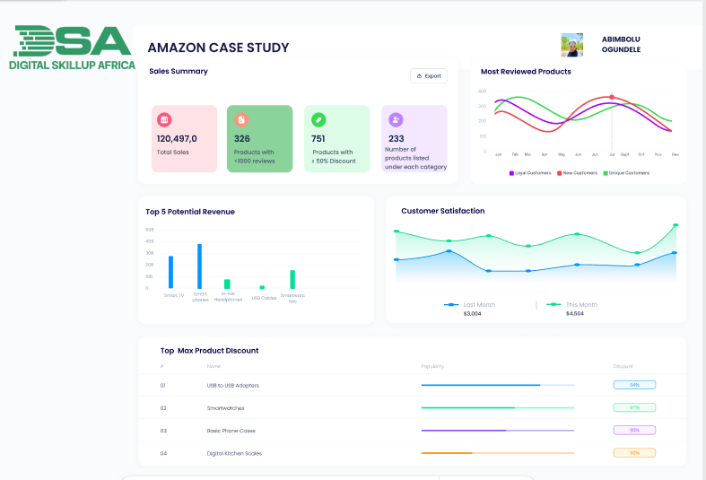

# Amazon Product and Customer Review Data Analysis

This project involved analysing a dataset of Amazon products and customer reviews to uncover valuable insights. The main goal was to understand product performance, customer sentiment, and market trends to help Amazon improve its products, refine marketing efforts, and boost customer engagement.

## Project Details
- Project Title: Amazon Product and Customer Review Data Analysis
- Tool Used: Excel Sheet
- Dataset Source: Digital SkillUp Africa
  
I began with a raw dataset named the Amazon case study. This file contained a lot of information about various products, including their names, categories, prices, ratings, and the number of reviews they received.

For this project, the cleaned data is represented in the [Cleaned_Amazon_Data](Cleaned_Amazon_Data.xlsx) file. 

# What typically happens during data cleaning:

**Handling Missing Information:** Sometimes, a product might not have a rating or a price listed. We handle these gaps by filling them in with reasonable estimates, or sometimes by removing entries if too much information is missing.

**Fixing Data Types:** Prices should be numbers so we can do calculations with them. If they were accidentally stored as text, we convert them to numbers.

**Removing Duplicates:** We check for any identical product entries that might skew our results and remove them.

**Creating New Information (Calculated Columns):** I also added new pieces of information that weren't directly in the original data but are very useful:

**Discount Percentage:** I calculated how much discount each product had by comparing its original price to its discounted price. This helped me understand pricing strategies.

**Total Potential Revenue:** This was calculated by multiplying actual_price by the rating_count. It gave me an idea of how much money a product could bring in based on its price and how many people have reviewed it (indicating popularity).

With my data clean and ready, I used a powerful tool called Pivot Tables and calculated columns to answer specific questions posed by the Amazon team. Think of a pivot table as a flexible summary tool that lets you quickly rearrange and summarise data in different ways to find patterns.

# 4. The Dashboard Overview

After analysing all these questions, the next step I took was to create a Dashboard. A dashboard is like a control panel that brings all the important insights together in a visual and easy-to-understand format. Instead of looking at raw numbers, we use charts, graphs, and key performance indicators (KPIs) to tell the data's story at a glance.

    ,,
   
The image contains the summarised data points and metrics that were used to build the visual dashboard. This dashboard would typically include KPI Cards and visuals showing:

* Average discount by category.

* Number of products per category.

* Total reviews per category.

* Distribution of product ratings.

* Top-rated products and products with the most reviews.

* Insights related to pricing and revenue potential.

This visual representation makes it much easier for Amazon's team to quickly grasp the key findings and make informed decisions without needing to dig through spreadsheets.

# 5. Key Insights and Recommendations
Based on all the analysis, here are some actionable suggestions for Amazon to guide product improvement, marketing strategies, and customer engagement:

## For Product Improvement:
- Focus on High-Rated Products and address the low-rated products: Identify the features and qualities common among products with the highest average ratings. These insights can be used to improve other products or guide new product development, and investigate products with consistently low ratings or a high number of negative reviews.

## For Marketing Strategies:

- Actively promote the "top 5 products in terms of rating and reviews combined." These products are to be proven customer favourites and can drive more sales.
- You can also analyse the relationship between ratings and discounts. If highly discounted products tend to have lower ratings, consider whether these discounts are effective or if they're just moving unpopular stock. If well-rated products are discounted, ensure these promotions are visible to maximise their impact.

## For Customer Engagement:

- Implement strategies to encourage more customers to leave reviews, especially for newer products or those with low review counts. This could include post-purchase emails or incentives.
- Actively monitor and respond to customer reviews, both positive and negative. This shows customers that their feedback is valued and can build trust and loyalty.

# Conclusion

This project showcases Amazon's product and customer review data, transforming raw numbers into clear, actionable insights. By cleaning the data, answering specific business questions with pivot tables and calculated columns, and visualising the findings in an Excel dashboard, I have equipped Amazon with the knowledge to make data-driven decisions that can lead to better products, more effective marketing, and stronger customer relationships.

# References & Resources

- Dataset: Digital SkillUp Africa
- GitHub Repository: Amazon Case Study
- Excel Sheet
